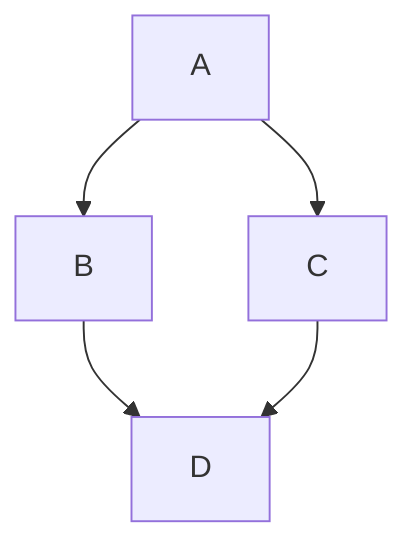

# HelloWorld #

A dummy repository on GitHub for testing.

Not supposed to actually do anything.

## Mermaid ##



Text text text text.

```mermaid
stateDiagram-v2
    [*] --> Still
    Still --> [*]

    Still --> Moving
    Moving --> Still
    Moving --> Crash
    Crash --> [*]
 ```
 
 Text text text text.
 
 ```mermaid
stateDiagram-v2
    [*] --> Idle

    Idle --> Busy
    Busy --> Busy
    Busy --> Idle
 ```
 
 Text text text text.
 
 
 

